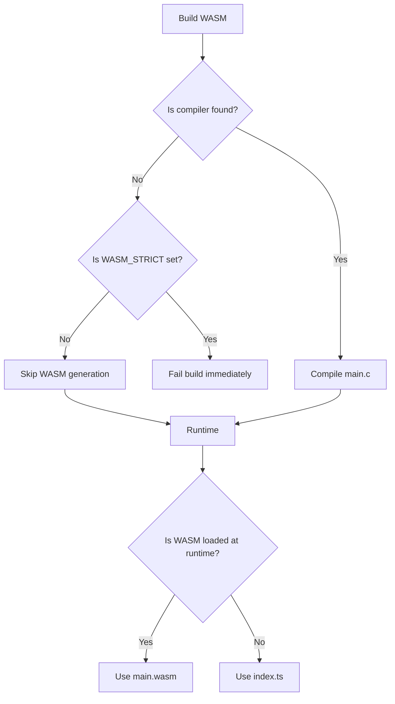
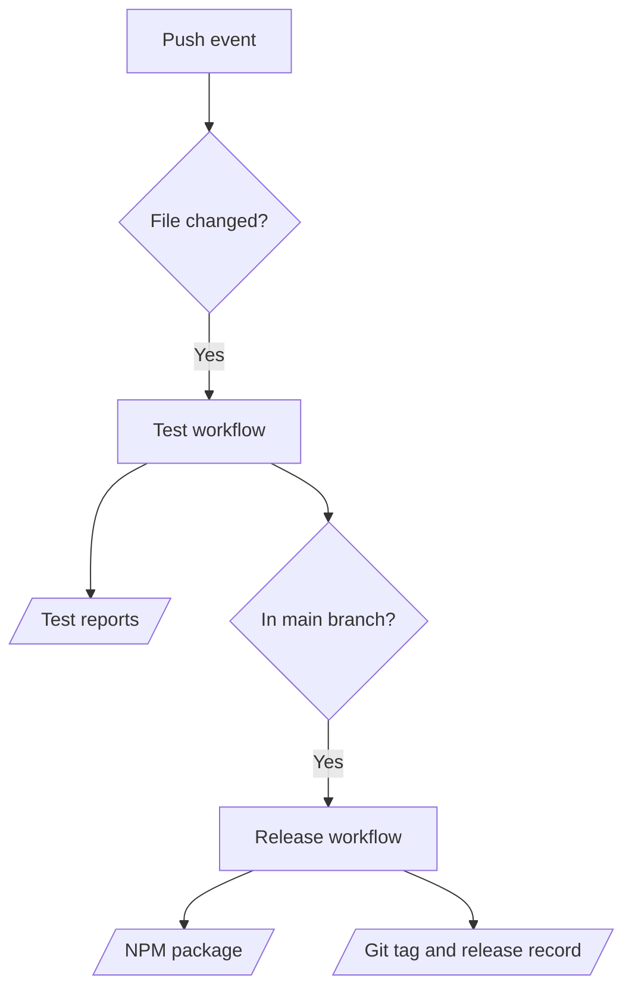

# CONTRIBUTING

[](https://conventionalcommits.org)

Thank you for contributing to Cryptography. Please read through the following guideline before making any contributions. You can find more details on the project structure, coding standards, architecture decisions, and compliance requirements in [.github/copilot-instructions.md](./.github/copilot-instructions.md) and [.github/instructions/](./.github/instructions/).

This repository has enabled GitHub Copilot and any other compatible A.I. code assistants to help contributors. Please see [.github/](./.github/) for agents and skills.

## Prerequisites

Required software for development and CI:

- [Node.js](https://nodejs.org/): `>= 25.2.1`
- [LLVM Clang](https://clang.llvm.org/): `>= 22.1.1`
- [LLVM LLD](https://lld.llvm.org/): `>= 22.1.1`

<details>
<summary>Setup macOS</summary>

We recommend using [NVM](https://github.com/nvm-sh/nvm) to manage Node.js versions on your machine. After setting up Node.js, you can install the Homebrew packages for WASM compilation:

```shell
brew install llvm
brew install lld
```

Compilers are detected in the following order:

1. `WASM_CLANG` environment variable
2. `/opt/homebrew/opt/llvm/bin/clang`
3. `clang` in `PATH`

> [!tip]
> Use a specific compiler explicitly:
>
> ```shell
> WASM_CLANG=/opt/homebrew/opt/llvm/bin/clang npm run build:wasm:strict
> ```

</details>

## Branching Strategy

This repository follows a simple [GitHub Flow](https://docs.github.com/en/get-started/using-github/github-flow) with some naming conventions to trigger [Semantic Release](https://github.com/semantic-release/semantic-release) for releases:

| Branch           | Release | Created From | Merge To |
| ---------------- | ------- | ------------ | -------- |
| `feature-<name>` |         | `main`       | `main`   |
| `main`           | `#.#.#` |              |          |

## Commands

[NPM scripts](./package.json) are organized with [ESLint Package.json Conventions](https://eslint.org/docs/latest/contribute/package-json-conventions):

| Command             | Purpose                                                         |
| ------------------- | --------------------------------------------------------------- |
| `build`             | Build WASM binaries, TypeScript output, and WASM assets.        |
| `build:clean`       | Remove generated build directories.                             |
| `build:typescript`  | Compile TypeScript and rewrite path aliases.                    |
| `build:wasm`        | Compile algorithm `main.c` files to `main.wasm` when available. |
| `build:wasm-assets` | Copy generated WASM binaries to build output tree.              |
| `build:wasm:check`  | Validate WASM artifacts and execute WASM smoke checks.          |
| `build:wasm:strict` | Compile WASM and fail when WASM compilation is unavailable.     |
| `release`           | Run semantic-release for tags, GitHub release, and npm publish. |
| `start`             | Run CLI directly from TypeScript sources.                       |
| `start:compiled`    | Run CLI from compiled build output.                             |
| `test`              | Run Jest test suite with default config.                        |
| `test:coverage`     | Run Jest with coverage output for CI and release validation.    |

## WebAssembly Behavior

Per-algorithm notes on WebAssembly behavior and guardrails:



## Workflows

GitHub Actions workflows for testing and releasing:


