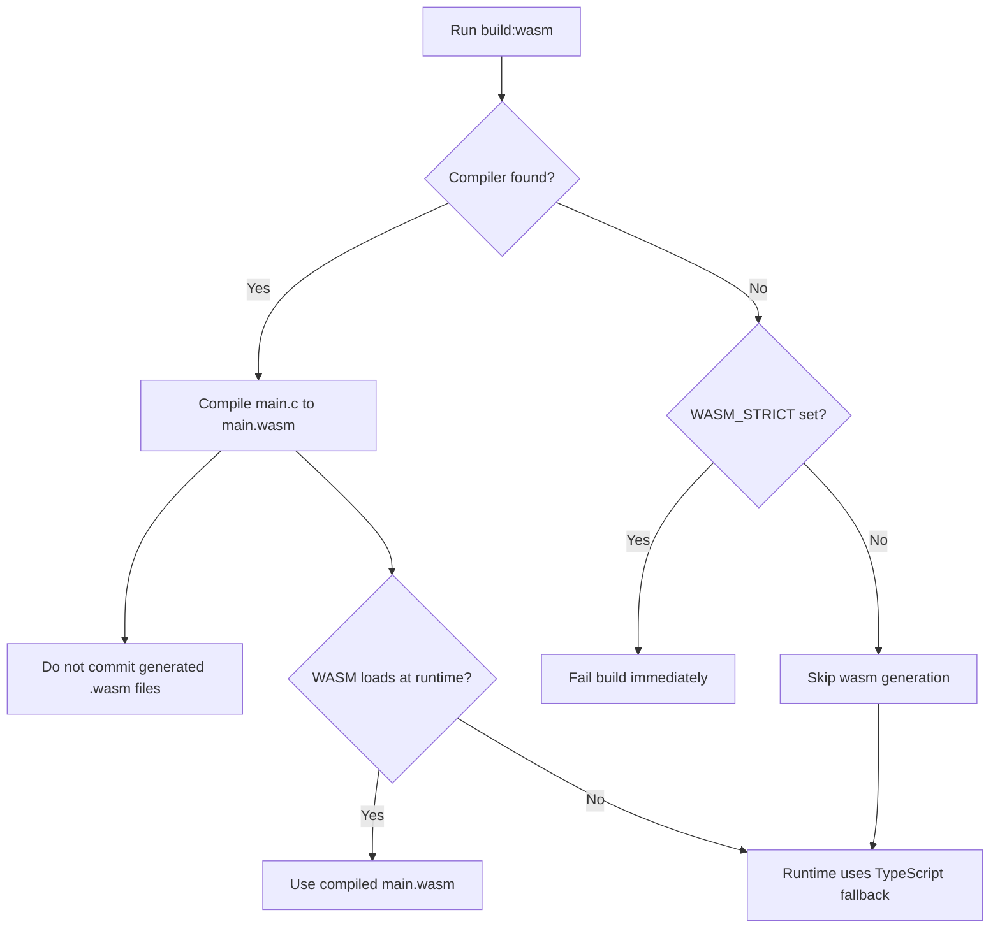
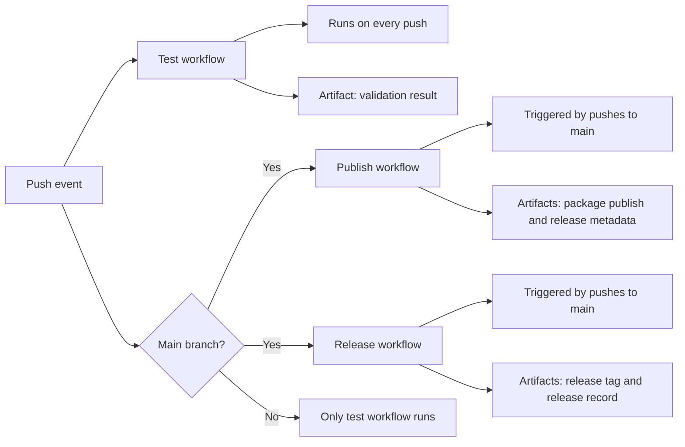

# CONTRIBUTING

Thank you for contributing to Cryptography. Please read through the following guideline before making any contributions.

## Prerequisites

Required software for development and CI:

- [Node.js](https://nodejs.org/): `>= 25.2.1`
- [LLVM Clang](https://clang.llvm.org/): `>= 22.1.1`
- [LLVM LLD](https://lld.llvm.org/): `>= 22.1.1`

<details>
<summary>Setup macOS</summary>

We recommend using [NVM](https://github.com/nvm-sh/nvm) to manage Node.js versions on your machine. After setting up Node.js, you can install the Homebrew packages for WASM compilation:

```shell
brew install llvm
brew install lld
```

Compilers are detected in the following order:

1. `WASM_CLANG` environment variable
2. `/opt/homebrew/opt/llvm/bin/clang`
3. `clang` in `PATH`

> [!tip]
> Use a specific compiler explicitly:
>
> ```shell
> WASM_CLANG=/opt/homebrew/opt/llvm/bin/clang npm run build:wasm:strict
> ```

</details>

## Branching Strategy

This is basically a Git Flow with some adjustment to fit the NPM release process:

| Branch           | Release           | Created From | Merge To             |
| ---------------- | ----------------- | ------------ | -------------------- |
| `develop`        |                   |              | `release`            |
| `feature-<name>` |                   | `develop`    | `develop`            |
| `main`           | `#.#.#`           |              |                      |
| `release`        | `#.#.#-release.#` | `main`       | `main` and `develop` |

## Project Structure

The project is structured as follows:

```plaintext
├── 📁 source
│   ├── 📁 algorithms
│   │   └── 📁 [algorithm]
│   ├── 📁 shared
│   ├── 📁 illustration       # key encryption flows
│   ├── command.ts
│   └── entry-point.ts        # package public exports only
├── 📁 scripts
└── 📁 build
```

## Commands

[NPM scripts](./package.json) are organized with [ESLint Package.json Conventions](https://eslint.org/docs/latest/contribute/package-json-conventions):

| Command              | Purpose                                                         |
| -------------------- | --------------------------------------------------------------- |
| `build`              | Build wasm binaries, TypeScript output, and wasm assets.        |
| `build:clean`        | Remove generated build directories.                             |
| `build:typescript`   | Compile TypeScript and rewrite path aliases.                    |
| `build:wasm`         | Compile algorithm `main.c` files to `main.wasm` when available. |
| `build:wasm-assets`  | Copy generated wasm binaries to build output tree.              |
| `build:wasm:check`   | Validate wasm artifacts and execute wasm smoke checks.          |
| `build:wasm:strict`  | Compile wasm and fail when wasm compilation is unavailable.     |
| `release`            | Run semantic-release for tags, GitHub release, and npm publish. |
| `start:cli`          | Run CLI directly from TypeScript sources.                       |
| `start:cli:compiled` | Run CLI from compiled build output.                             |
| `test`               | Run Jest test suite with default config.                        |
| `test:coverage`      | Run Jest with coverage output for CI and release validation.    |

## WebAssembly Behavior

<!--
Some notes on WebAssembly behavior and guardrails:

- Generated `.wasm` files are ignored on purpose
- NPM scripts skip WASM generation when no compiler is detected, unless `WASM_STRICT` is used to fail immediately
- If WASM is unavailable at runtime (Algorithms attempt to use its own compiled `main.wasm`), code falls back to TypeScript automatically
-->

Some notes on WebAssembly behavior and guardrails:



## Coding conventions

<!--
- Each algorithm folder contains:
  - `index.ts` (TypeScript implementation)
  - `index.test.ts` (tests)
  - `main.c` (WASM source)
- Use default export for each algorithm function in `index.ts`.
- Use a shared higher-order WASM wrapper under `source/shared/wasm.ts` for runtime loading only.
- Use `@/` imports for code under `source/` (configured in `tsconfig.json`).
- Do not import internal code from `@/entry-point`; import directly from `@/<folder>` (e.g., `@/algorithms/...`).
- Keep algorithm APIs stable and deterministic for tests.
-->

Each algorithm folder contains:

```plaintext
├── index.ts      # algorithm implementation
├── index.test.ts # tests
└── main.c        # algorithm implementation in C for WASM compilation
```

- Use `export default function main` for each algorithm implementation
  1. Check if WASM (`main.wasm` compiled from `main.c`) is available with a global generic wrapper
  2. If available, proceed with WASM implementation
     1. Check input prerequisites in C
     2. Errors thrown in C should be propagated and handled in TypeScript
        - Friendly error messages are provided in C already
  3. If not available, fall back to TypeScript implementation
     1. Check input prerequisites in TypeScript
     2. Errors thrown in TypeScript should be consistent with C error messages when the same input is given
- Use `export async function prompt` for each algorithm CLI demonstration
- Use `@/*` imports for code under `source/*`
- Do not import internal code from `@/entry-point`
- Keep algorithm APIs stable and deterministic for tests

## Workflows

<!--
- `Test`: runs on every push and executes `npm run test:coverage -- --ci --runInBand --verbose`.
- `Publish`: runs on every push to `main` using Node.js 25 and semantic-release.
- `Release`: runs on every push to `main` using Node.js 25 and semantic-release.
-->


