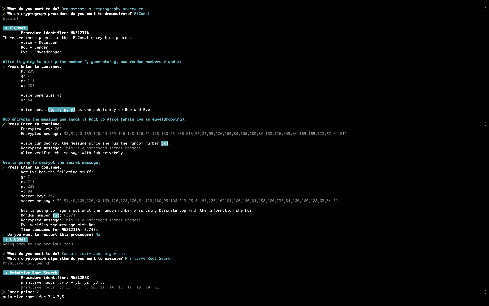

# Cryptography

[](https://conventionalcommits.org)

This library provides a collection of cryptography algorithms. It serves as a learning resource (Inspired by [Boston University MET CS 789](https://www.bu.edu/academics/met/courses/met-cs-789/)) for understanding the implementation of various cryptographic algorithms and their applications in key encryption flows. The library is also production-ready, with a focus on performance and security, making it suitable for use in real-world applications:

| Algorithm                   | JavaScript | TypeScript | WebAssembly |
| --------------------------- | ---------- | ---------- | ----------- |
| Baby Step Giant Step        | ✅         | ✅         | ✅          |
| Blum Blum Shub              | ✅         | ✅         | ✅          |
| Chinese Remainder           | ✅         | ✅         | ✅          |
| Euclidean                   | ✅         | ✅         | ✅          |
| Extended Euclidean          | ✅         | ✅         | ✅          |
| Fast Modular Exponentiation | ✅         | ✅         | ✅          |
| Miller Rabin Primality Test | ✅         | ✅         | ✅          |
| Multiplicative Inverse      | ✅         | ✅         | ✅          |
| Naor Reingo                 | ✅         | ✅         | ✅          |
| Pollard P-1 Factorization   | ✅         | ✅         | ✅          |
| Pollard Rho                 | ✅         | ✅         | ✅          |
| Primitive Root Search       | ✅         | ✅         | ✅          |

> [!tip]
> Zero configuration needed. WebAssembly availability is determined at runtime, with a safe fallback to JavaScript with TypeScript support implemented.

And, a CLI is available to interact with these algorithms and demonstrate the 3 key encryption flows:

- [Diffie Hellman Key Exchange](./source/key-encryption/DiffieHellman.ts)
- [ElGamal](./source/key-encryption/ElGamal.ts)
- [RSA](./source/key-encryption/RSA.ts)

## Installation

The package is available on NPM:

```bash
npm install @siegesailor/cryptography
```

### Prerequisites

Required software for this module:

- [Node.js](https://nodejs.org/): `>= 25.2.1`

## Use as a Library

You can use it in ESM:

```ts
import {
  fastModularExponentiation,
  millerRabinPrimalityTest,
  euclidean,
} from "@siegesailor/cryptography";

const gcd = euclidean(614n, 513n);
const modPow = fastModularExponentiation(2n, 100n, 71n);
const isPrime = millerRabinPrimalityTest(104729n, 10);
```

Or, you can use it in CommonJS:

```js
const {
  euclidean,
  fastModularExponentiation,
  millerRabinPrimalityTest,
} = require("@siegesailor/cryptography");
```

## Use as a CLI



Run directly with NPX:

```bash
npx @siegesailor/cryptography
```
